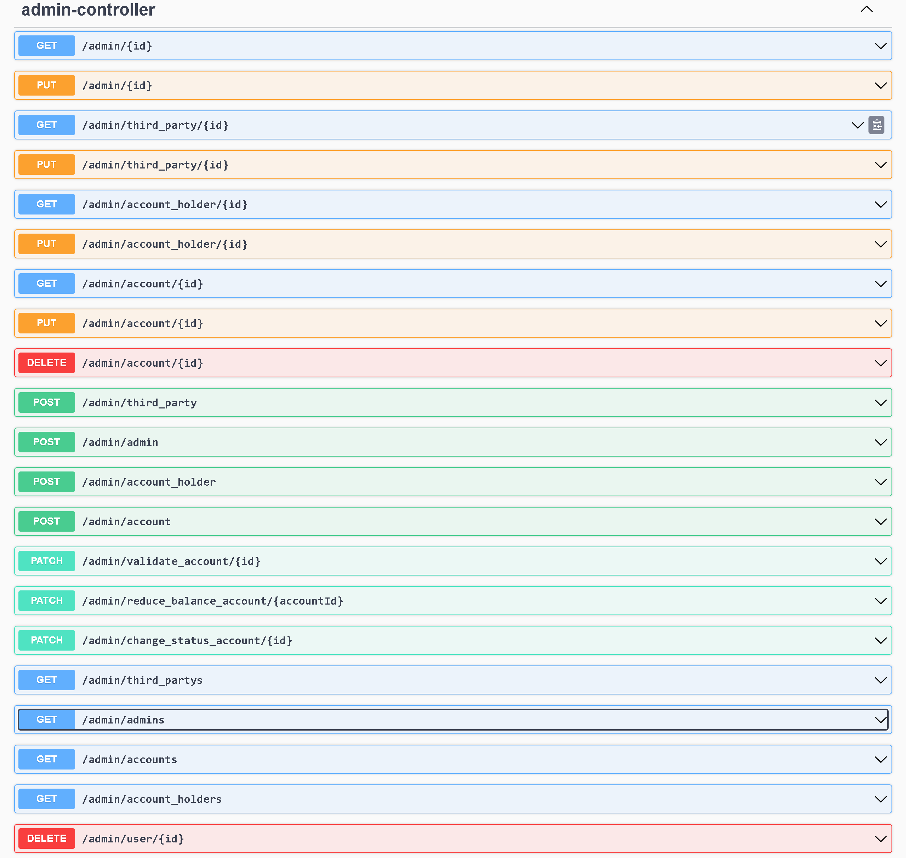
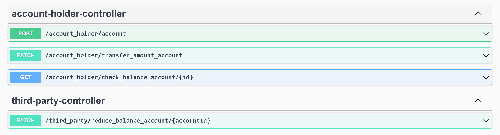
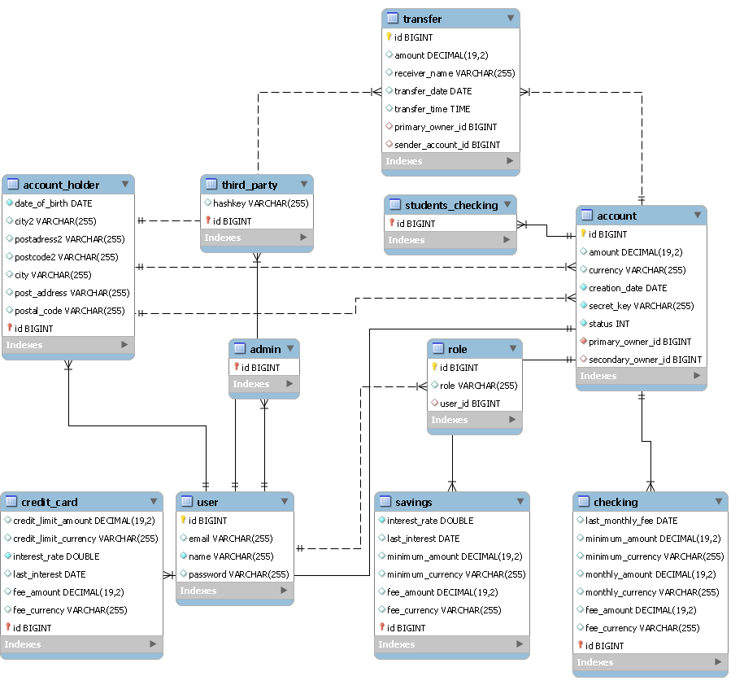
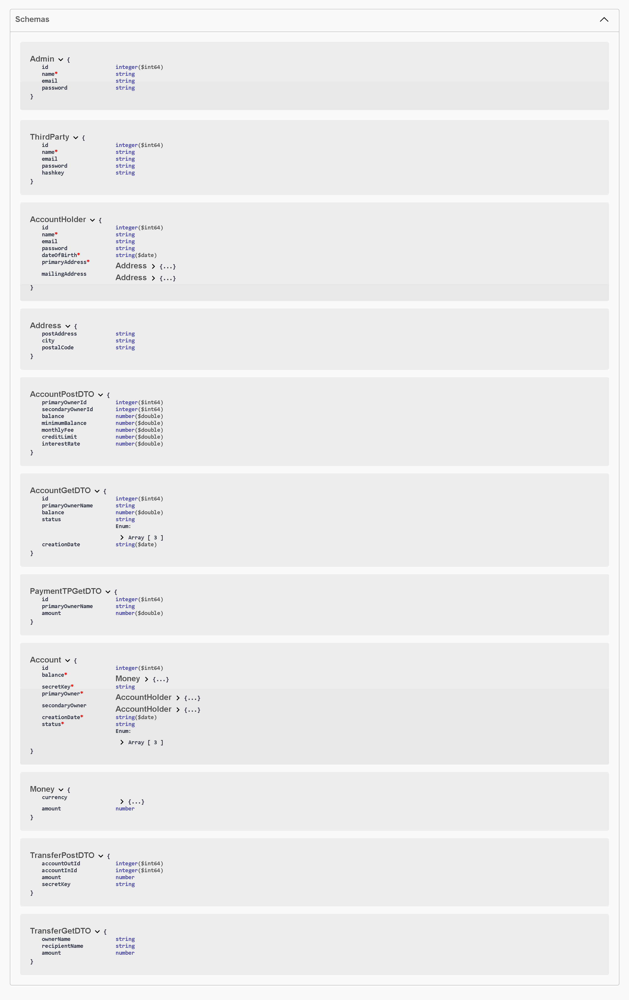

# BankingApp
# **WELCOME to PaloosaBank App!**

## EXTRA, EXTRA!!

**BONUS DONE!**

**- Check Fraud 2 transfers in less than a second. CHECKED
- Check Fraud Primary Owner spended daily 150% more than ever. CHECKED**

# MORE BONUS!!!
- **Account Holder can create an INACTIVE Account, pending to be revised an activated by an Admin.**
- **Admins can Validate() an Account created by an AccountHolder.**
- **Admin can GET, POST, PUT and DELETE everything. I made him OmniPowerful.**
- **The MonthlyMaintanceFee is substracted correctly even if the rquirements don't talk about it.**
- I use the SecretKey to ensure that AccountHolders just can use their accounts.
- Haskeys and SecretKeys are created automatically.
- I tested more and beyond! ^^
- **Swagger friendly** ;)
- 
  
  

- 
This is my final project in IronHack. It's gonna be a Java based OnlineApp using Spring to work with a database.
I invested all my time to do it and redo it the best that i can. Because de learning. ^^

# -------------TRASCENDENT TESTS----------

**AccountHolderController Tests:**
-transferAccountHolderAnyAccountReduce_OK
-transferAccountHolderAnyAccountIncrements_OK
-transferAccountHolderAnyAccountAddTransfer_OK
-transferAccountHolderAnyAccountWrongSecretKey_OK
-transferAccountHolderAnyAccountNotEnoughFounds_OK
-transferAccountHolderAnyAccountFrozenOrInactive_OK
-transferAccountHolderAnyAccountCheckFraudLessSecond_OK
-transferAccountHolderAnyAccountCheckFraudTooMuch24h_OK
-transferAccountHolderAnyAccountMinimumBalanceAndPenaltyFee_OK
-transferAccountHolderAnyAccountMonthlyMaintanceFee_OK
-transferAccountHolderAnyAccountMonthlyInterestsAdded_OK
-transferAccountHolderAnyAccountYearlyInterestsAdded_OK
-getBalanceAccountAccountHolder_OK
-getBalanceAccountAccountHolderWrongSecretKey_OK
-postCheckingFromHolder_OK
-postCreditCardFromHolder_OK
-postSavingsFromHolder_OK
-postStudentsCheckingFromHolder_OK
-postStudentsCheckingFromHolderIf24_OK
-postAccountFromHolderINACTIVE_OK

**AdminController Tests:**
-postAdminByAdmin_OK
-postThirdPartyByAdmin_OK
-postAccountHolderByAdmin_OK
-postCheckingFromAdmin_OK
-postStudentsCheckingFromAdminIf24_OK
-postCreditCardFromAdmin_OK
-postSavingsFromAdmin_OK
-postStudentsCheckingFromAdmin_OK
-getAdminById_OK
-getAllAdmins_OK
-getAccountHolderById_OK
-getAllAccountHolders_OK
-getThirdPartyById_OK
-getAllThirdPartys_OK
-getAccountById_OK
-getAllAccounts_OK
-deleteUserById_OK
-deleteAccountById_OK
-patchAnyAccountBalanceFromAdmin_OK
-patchAnyAccountStatusFromAdmin_OK
-updateAdminByAdmin_OK
-updateupdateThirdPartyByAdmin_OK
-updateAccountHolderByAdmin_OK
-updateAnyAccountByAdmin_OK

**ThirdPartyController Tests:**
- patchThirdPartyAnyAccountBalance_OK

**TransferRepository Tests:**
-findBySenderAccountId_OK
-findByPrimaryOwnerId_OK
-findByAmount_OK
-findByTransferDate_OK
-findByTransferTime_OK
-max24HourAmount_OK

## **ALL THE SCHEMAS**

# **Requirements**

The system must have 4 types of accounts: StudentChecking, Checking, Savings, and CreditCard.

Checking

Checking Accounts should have:

A balance
A secretKey
A PrimaryOwner
An optional SecondaryOwner
A minimumBalance
A penaltyFee
A monthlyMaintenanceFee
A creationDate
A status (FROZEN, ACTIVE)

StudentChecking

Student Checking Accounts are identical to Checking Accounts except that they do NOT have:

A monthlyMaintenanceFee
A minimumBalance

Savings

Savings are identical to Checking accounts except that they

Do NOT have a monthlyMaintenanceFee
Do have an interestRate

CreditCard

CreditCard Accounts have:

A balance
A PrimaryOwner
An optional SecondaryOwner
A creditLimit
An interestRate
A penaltyFee

The system must have 3 types of Users: Admins and AccountHolders.

AccountHolders

The AccountHolders should be able to access their own accounts and only their accounts when passing the correct 
credentials using Basic Auth. AccountHolders have:

A name
Date of birth
A primaryAddress (which should be a separate address class)
An optional mailingAddress

Admins

Admins only have a name

ThirdParty

The ThirdParty Accounts have a hashed key and a name.

Admins can create new accounts. When creating a new account they can create Checking, Savings, or CreditCard Accounts.

Savings

Savings accounts have a default interest rate of 0.0025
Savings accounts may be instantiated with an interest rate other than the default, with a maximum interest rate 
of 0.5
Savings accounts should have a default minimumBalance of 1000
Savings accounts may be instantiated with a minimum balance of less than 1000 but no lower than 100

CreditCards

CreditCard accounts have a default creditLimit of 100
CreditCards may be instantiated with a creditLimit higher than 100 but not higher than 100000
CreditCards have a default interestRate of 0.2
CreditCards may be instantiated with an interestRate less than 0.2 but not lower than 0.1

CheckingAccounts

When creating a new Checking account, if the primaryOwner is less than 24, a StudentChecking account should be 
created otherwise a regular Checking Account should be created.
Checking accounts should have a minimumBalance of 250 and a monthlyMaintenanceFee of 12

Interest and Fees should be applied appropriately

PenaltyFee

The penaltyFee for all accounts should be 40.
If any account drops below the minimumBalance, the penaltyFee should be deducted from the balance automatically

InterestRate

Interest on savings accounts is added to the account annually at the rate of specified interestRate per year. That 
means 
that if I have 1000000 in a savings account with a 0.01 interest rate, 1% of 1 Million is added to my account after 
1 year. 
When a savings account balance is accessed, you must determine if it has been 1 year or more since either the account was 
created or since interest was added to the account, and add the appropriate interest to the balance if necessary.

Interest on credit cards is added to the balance monthly. If you have a 12% interest rate (0.12) then 1% interest will 
be added to the account monthly. When the balance of a credit card is accessed, check to determine if it has been 1 
month 
or more since the account was created or since interested was added, and if so, add the appropriate interest to the 
balance.

Account Access

Admins

Admins should be able to access the balance for any account and to modify it.

AccountHolders

AccountHolders should be able to access their own account balance
Account holders should be able to transfer money from any of their accounts to any other account (regardless of owner). 
The transfer should only be processed if the account has sufficient funds. The user must provide the Primary or Secondary 
owner name and the id of the account that should receive the transfer.

Third-Party Users

There must be a way for third-party users to receive and send money to other accounts.
Third-party users must be added to the database by an admin.
In order to receive and send money, Third-Party Users must provide their hashed key in the header of the HTTP request. They also must provide the amount, the Account id and the account secret key.

Extra features (bonus)
Fraud Detection

The application must recognize patterns that indicate fraud and Freeze the account status when potential fraud is 
detected.

Patterns that indicate fraud include:

Transactions made in 24 hours total to more than 150% of the customers highest daily total transactions in any other 
24 hour period.
More than 2 transactions occurring on a single account within a 1 second period.
